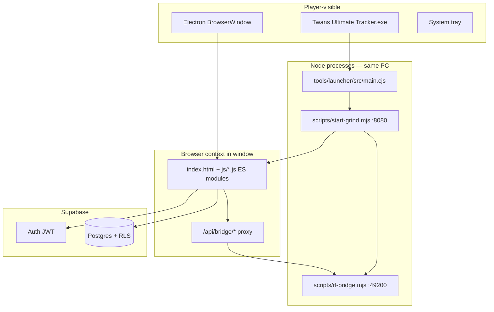

# Twans Ultimate Tracker — Architecture

Single source of truth for how the desktop product works. Read this file first before changing runtime behavior, sync, or auto-log.

Related: [`DESKTOP-VISION.md`](DESKTOP-VISION.md) (product goals), [`ROADMAP.md`](ROADMAP.md) (priorities), [`TECH-AUDIT-DESKTOP.md`](TECH-AUDIT-DESKTOP.md) (dead files / safe cleanup).

---

## Product shape

| Surface | Role | Audience |
|---------|------|----------|
| **Desktop app** (`Twans Ultimate Tracker.exe` / NSIS installer) | Primary product — embedded UI, tray, auto-log, sessions | Players |
| **Local HTTP stack** (`:8080` + `:49200`) | Serves SPA + proxies bridge; hidden from players | Dev / runtime only |
| **GitHub Pages** (`index.html` on gh.io) | Manual log bookmark only — no local bridge | Legacy / share link |
| **Supabase** | Auth, profiles, matches, settings, squads | Cloud sync |

**Principle:** Players see human status (`Tracking`, `Waiting for Rocket League`, `Connection issue`) — not ports, bridge, or localhost. Technical detail goes to `console.debug` via `logStatusDebug()` in `js/status-copy.js`.

---

## Desktop architecture



### Layers

| Layer | Path | Responsibility |
|-------|------|----------------|
| **Electron shell** | `tools/launcher/src/main.cjs` | Single instance, tray icon, `BrowserWindow`, spawn `start-grind.mjs`, health poll, crash restart (max 8), minimize-on-close |
| **Grind launcher** | `scripts/start-grind.mjs` | Static file server on `:8080`, `/api/bridge` reverse proxy to `:49200`, CORS, auth token injection |
| **Bridge API** | `scripts/rl-bridge.mjs` | RL Stats TCP `:49123`, Val Henrik poll, process watcher, game launch, setup apply |
| **SPA frontend** | `index.html`, `js/`, `css/` | Dashboard, dock, sessions, onboarding, Supabase sync |
| **Bundled scripts** | `process.resourcesPath/bridge-scripts` in packaged exe | Copy of `scripts/` shipped inside Electron resources |

Legacy duplicate: repo root `launcher/` mirrors `tools/launcher/` — **use `tools/launcher/` only** (see [`TECH-AUDIT-DESKTOP.md`](TECH-AUDIT-DESKTOP.md)).

---

## Startup flow

```
Twans Ultimate Tracker.exe
  → Electron main.cjs (app.ready)
  → findDataRoot() + findNodeExecutable() + findBridgeScriptsDir()
  → spawn: node start-grind.mjs
       → startBridge() on :49200 (rl-bridge.mjs)
       → http.createServer static + /api/bridge proxy on :8080
  → waitForTrackerReady() — GET http://127.0.0.1:8080/api/bridge/status
  → createMainWindow() → loadURL http://127.0.0.1:8080
  → SPA: js/app.js init()
       → initAuth()
       → startBridgeHeartbeat() (client polls /api/bridge/status)
       → on auth: boot.js bootApp()
            → [desktop] waitForDesktopServices() until bridge reachable
            → loadUserData() from Supabase
            → repair rank chains, onboarding, render UI
```

**Dev path (DEVELOPER ONLY):** `Rocket League Tracker.bat` / `Valorant Tracker.bat` run `start-grind.mjs` directly and open a browser tab — same ports, no Electron shell.

**Detection:** `js/env.js` → `isDesktopHost()` checks `navigator.userAgent` for `Electron`. `isLocalTrackerHost()` is `localhost|127.0.0.1:8080`.

---

## Data flow

### Local state

| Store | Key / module | Contents |
|-------|----------------|----------|
| `localStorage` | `rl-grind-prefs` | active game, Riot ID, RL name, auto-log toggle |
| `localStorage` | `rl-grind-session` | active session timer + session number |
| `localStorage` | `rl-grind-auto-session` | auto session on/off (default on) |
| `localStorage` | `rl-grind-onboarding` | wizard step progress |
| `localStorage` | `rl-grind-offline-queue` | failed Supabase writes (`js/offline-queue.js`) |
| In-memory | `js/state.js` | games[], profile, goals, filters, sync status |

### Supabase sync

Entry: `js/supabase.js`

| Operation | Tables / endpoints | Notes |
|-----------|-------------------|--------|
| Auth | Supabase Auth (Google + email) | `js/auth.js`, PKCE, session in client |
| Profile | `profiles` | display name, colors, avatar |
| Matches | `matches` | RL + Val rows; Val uses legacy column mapping + `stats` JSONB |
| Settings | `user_settings` | goals, bio, `rankBaselines`, riotId, rlDisplayName |
| Groups | `groups`, `group_members` | squad invites |

**Offline queue:** On network failure, `enqueueOfflineWrite()` stores games/settings payloads; `flushOfflineQueue()` retries on next successful load (`shouldQueueSyncError()`).

**RLS:** All tables are user-scoped via Supabase Row Level Security — client uses **anon key** only; never ship `service_role`. Policies live in `docs/supabase/v1-full-setup.sql`.

---

## Auto-log pipeline

### Rocket League

1. `DefaultStatsAPI.ini` (or bridge apply) enables RL Stats API → TCP `:49123`
2. `rl-bridge.mjs` parses match-end packets
3. `js/rl-live.js` polls bridge; `js/auto-log-handlers.js` → `handleAutoLog()`
4. MMR delta estimated or taken from packet; `addGame()` → Supabase
5. Rank chain: `js/games/rocketleague/rank-chain.js` → `repairPlaylistMMRChain()` on boot

### Valorant

1. Player configures Riot ID + Henrik API key in setup → `applyBridgeSetup()` writes `grind-config.json`
2. `valorant-bridge.mjs` polls Henrik API after match end
3. `js/valorant-live.js` arms polling; `handleValorantAutoLog()` in `auto-log-handlers.js`
4. RR promotion: `js/games/valorant/rank-ladder.js` → `applyRRDelta()` (≥100 carry, <0 demote)
5. Chain repair: `js/games/valorant/rank-chain.js` → `repairRankChain()` on boot

### Process detection

`scripts/process-watcher.mjs` exposes process state on bridge `/status`.  
`js/process-session.js` polls every 5s when bridge up + auto-session enabled:

- Game **starts** → `startSession({ silent: true })`
- Game **exits** → `endSession({ auto: true })`

On desktop (`isDesktopHost()`), manual Start is hidden when auto-session is on (`shouldHideManualSessionControls()`).

---

## Session lifecycle

| Event | Handler | UX |
|-------|---------|-----|
| Manual start | `sessions.js` → `startSession()` | Dock/dashboard (dev / GitHub Pages) |
| Play button | `game-launcher.js` → `launchGame()` + silent start | Desktop primary path |
| Process detect start | `process-session.js` | Toast on Val start |
| Process exit end | `process-session.js` → `endSession({ auto: true })` | Summary modal if games logged |
| Manual end | `endSession()` | "End early" on desktop when auto-session |
| Persist | `localStorage` + `restoreSessionFromStorage()` on boot | Survives refresh |
| Stale | `STALE_SESSION_MS` (6h) in `sessions.js` | Auto-clear |

---

## Game-specific flows

### Rocket League baseline MMR

- Onboarding step `rl-mmr` (`js/onboarding-wizard.js`)
- Stored in `user_settings.rankBaselines` via `js/rank-baselines.js`
- First auto-logged match uses baseline — no manual rank edit required

### Valorant rank + RR

- Onboarding: `val-rank` then `val-rr` (0–100 within tier)
- `applyRRDelta()` handles promotion/demotion including Radiant → Immortal 3
- `rank-chain.js` rewrites inconsistent history using same math

---

## Folder responsibilities

| Path | Purpose |
|------|---------|
| `js/` | SPA application — boot, auth, UI, games, sync |
| `js/games/rocketleague/` | RL-specific stats, ranks, chain repair |
| `js/games/valorant/` | Val ranks, ladder, chain, insights |
| `js/core/` | Shared utilities (dates, dom-safe, logging-session) |
| `js/qa/` | Dev-only QA panel (localhost) |
| `scripts/` | Node bridge + grind launcher (bundled into exe) |
| `tools/launcher/` | Electron app build (`package.json`, `main.cjs`, NSIS) |
| `integrations/overwolf/` | Optional Val feed (most users use Henrik) |
| `legal/` | Privacy, terms, disclaimer static pages |
| `docs/` | Product + engineering documentation |
| `config/` | `grind-config.json`, `bridge-launcher.json` (local, not committed secrets) |
| Root `*.bat` | **DEVELOPER ONLY** — local dev launchers, build scripts |

**Entry points (frontend):** `js/app.js` (main), `js/boot.js` (post-auth load), `index.html` (shell).

---

## Supabase interactions (quick reference)

```
signIn → JWT in client
loadUserData() → profiles + matches + user_settings + groups
saveGames() / saveSettings() / saveProfile() → REST with user JWT
deleteOwnAccount() → edge RPC or REST delete cascade
```

Auth module loads `@supabase/supabase-js` from CDN with fallback to `vendor/supabase-js.mjs`.

---

## Human status model

Defined in `js/status-copy.js`:

| Label | When |
|-------|------|
| **Tracking** | Game running / in-match / auto-log armed |
| **Waiting for Rocket League / Valorant** | App up, game not running |
| **Connection issue** | Bridge down, wrong host, repeated probe failure |
| **Starting…** | Boot / reconnect |

Rendered by `js/bridge-ui.js` (`refreshBridgeStatusUI`) and tray (`main.cjs`).

---

## Update process

| Phase | Mechanism | Status |
|-------|-----------|--------|
| **Current** | Manual rebuild: `build-tray-app.bat` → `tools/launcher/dist/` + copy to root exe | ✅ |
| **Phase 2** | In-app settings (no JSON edit) | Planned |
| **Phase 4** | `electron-updater` delta channel | Planned |

Version: `version.json` → `js/core/version.js` via `node scripts/sync-version.mjs`.

---

## Dev-only artifacts

All root `*.bat` files are marked **DEVELOPER ONLY** in file headers:

- `Rocket League Tracker.bat`, `Valorant Tracker.bat` — browser dev stack
- `build-tray-app.bat` — package portable exe
- `start-grind.bat`, `push-updates.bat`, etc.

Players install **`TwansUltimateTrackerSetup.exe`** only.

---

## Gap matrix (vision vs current vs next)

| Requirement | Vision | Current | Next step |
|-------------|--------|---------|-----------|
| One-click install | NSIS Setup.exe | Config exists; smoke on fresh VM **not run** | QA installer smoke → v1.0 tag |
| Embedded window | No external browser | ✅ Electron `BrowserWindow` | — |
| Human status | No port/bridge jargon | ✅ `status-copy.js` + bridge-ui | Finish setup-wizard dev copy (Phase 2) |
| Auto session start/end | Process-driven | ✅ `process-session.js` | — |
| Hide manual session (desktop) | Play → auto track | ✅ `shouldHideManualSessionControls()` | — |
| Boot gate (services before UI) | No login flash | ✅ `waitForDesktopServices()` in boot.js | — |
| Onboarding | Games → RL MMR → Val rank → Val RR | ✅ 4 wizard steps after sign-in | V1.1 copy polish only |
| Offline sync | Queue + retry | ✅ `offline-queue.js` stub | Broader write types if needed |
| In-app Henrik / paths | No file editing | JSON + setup page | **Phase 2** settings panel |
| Bundled Node | No nodejs.org install | Uses system `node` or PATH | **Phase 3** `node-runtime/` |
| Auto-update | Discord-style | Manual rebuild | **Phase 4** electron-updater |
| Native notifications | Match saved, session end | None | **Phase 4** |
| macOS | Optional | Windows only | **Phase 5** |

---

## Key files map

| Concern | Files |
|---------|-------|
| Electron | `tools/launcher/src/main.cjs`, `tools/launcher/package.json` |
| HTTP + proxy | `scripts/start-grind.mjs`, `scripts/bridge-security.mjs` |
| Bridge | `scripts/rl-bridge.mjs`, `scripts/valorant-bridge.mjs`, `scripts/process-watcher.mjs` |
| Client bridge | `js/bridge-client.js`, `js/bridge-ui.js` |
| Boot | `js/app.js`, `js/boot.js`, `js/env.js` |
| Sessions | `js/sessions.js`, `js/process-session.js` |
| Onboarding | `js/onboarding-wizard.js`, `js/rank-baselines.js` |
| Sync | `js/supabase.js`, `js/offline-queue.js` |
| Status copy | `js/status-copy.js` |

---

## Regression & verification

- Static: `node --check` on all `js/**/*.js` — see [`REGRESSION-CHECKLIST-DESKTOP.md`](REGRESSION-CHECKLIST-DESKTOP.md)
- Manual desktop smoke: [`DESKTOP-VISION.md`](DESKTOP-VISION.md) § Manual smoke
