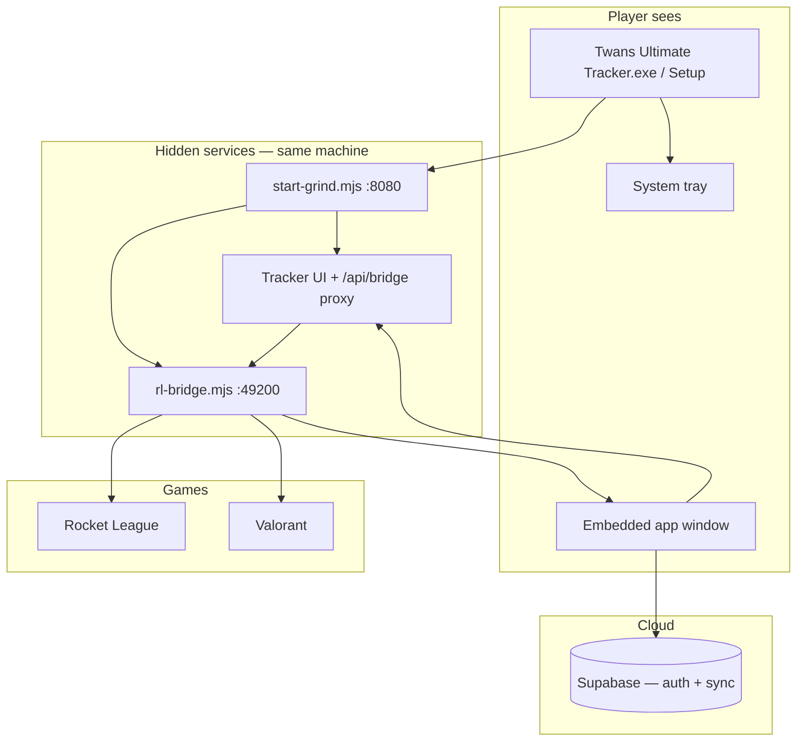

# Desktop Vision — Twans Ultimate Tracker

Twans Ultimate Tracker is a **premium Windows desktop app** (Discord / Steam tier). Players install one app, sign in, click Play, and grind — no browsers, batch files, ports, or bridge jargon in normal use.

**Player flow:** `TwansUltimateTrackerSetup.exe` → open app → sign in → **Play RL** / **Play Val** → play. Everything else is automatic.

Technical stack (hidden from players): Electron shell + embedded UI + local HTTP services + Supabase sync.

Related: [`DESKTOP-APP-MISSION.md`](DESKTOP-APP-MISSION.md) (Phase 1 audit), [`ROADMAP.md`](ROADMAP.md) (priorities).

---

## Product principles

| Principle | Meaning |
|-----------|---------|
| **One app** | Single installer, tray icon, embedded window — not “open localhost in Chrome” |
| **Human status** | Tracking · Waiting for Rocket League · Waiting for Valorant · Connection issue |
| **Invisible plumbing** | Bridge, ports, Node, `.bat` files are dev-only |
| **Data integrity** | Existing rank chains, auto-log, and Supabase RLS stay authoritative |
| **Graceful offline** | Queue failed writes locally; retry when online |

---

## Architecture (bundled desktop)

| Layer | Role | Player-visible? |
|-------|------|-----------------|
| **Electron launcher** | Tray, embedded `BrowserWindow`, crash restart, Open/Quit | Tray + window only |
| **Tracker UI** | Dashboard, dock, sessions, onboarding, settings | Yes — entire UX |
| **HTTP proxy (:8080)** | Serves static app + `/api/bridge/*` | No |
| **Bridge API (:49200)** | RL Stats TCP, Val Henrik poll, process detect, game launch | No |
| **Supabase** | Auth, matches, settings, profile | Sign-in + sync indicator |
| **Local cache** | localStorage prefs, session state, offline queue | No |

---

## What exists vs what’s needed

| Capability | Status | Notes |
|------------|--------|-------|
| Portable exe + tray | ✅ Exists | `Twans Ultimate Tracker.exe` |
| NSIS installer config | ✅ Phase 1 | `TwansUltimateTrackerSetup.exe` via electron-builder |
| Embedded window | ✅ Phase 1 | Loads app in-process; browser fallback |
| Crash restart (bridge) | ✅ Exists | Up to 8 retries |
| Human status copy | ✅ Phase 1 | `js/status-copy.js`, bridge-ui |
| Play buttons + game launch | ✅ Exists | Dock + dashboard |
| Auto session **start** on process | ✅ Exists | `process-session.js` |
| Auto session **end** on process exit | ✅ Phase 1 | Wired to `sessions.js` |
| Onboarding 5 steps | ✅ Phase 1 | Games → RL MMR → Val rank → Val RR |
| Val RR promotion (≥100 carry) | ✅ Exists | `rank-ladder.js` `applyRRDelta` |
| Val demotion (<0) | ✅ Exists | Tier demote + RR carry; Radiant → Immortal 3 |
| Offline write queue | ✅ Minimal Phase 1 | `js/offline-queue.js` + supabase retry |
| In-app settings (no JSON edit) | ⏳ Phase 2 | Henrik key, paths in UI |
| Bundled Node (no install) | ⏳ Phase 3 | `node-runtime` stub path exists |
| Auto-update (Discord-style) | ⏳ Phase 4 | electron-updater + channel |
| macOS | ⏳ Phase 5 | After Windows polish |

**Dev-only (kept, not deleted):** all root `*.bat` files marked `DEVELOPER ONLY`.

---

## Onboarding (first run)

After sign-in, new accounts with no match history:

1. **Choose games** — RL, Val, or both  
2. **RL MMR baseline** — per playlist (if RL selected)  
3. **Valorant rank** — tier per queue (if Val selected)  
4. **Valorant RR** — 0–100 within tier (if Val selected)  

Baselines persist to Supabase `user_settings.rankBaselines` so the **first auto-logged match** does not need manual rank edit.

Implementation: `js/onboarding-wizard.js`, `js/rank-setup-ui.js`, `js/rank-baselines.js`.

---

## Sessions & process detection

| Event | Behavior |
|-------|----------|
| Game process **starts** | Auto **start** session (if enabled, no active session) |
| Game process **exits** | Auto **end** session — summary modal if games logged; quiet end if empty |
| App window **closed** | Minimize to tray; tracking continues |
| App **Quit** from tray | Stop services cleanly |

Process poll: `js/process-session.js` + bridge `GET /processes` / status fields.

---

## Valorant rank / RR rules

All promotion logic lives in `js/games/valorant/rank-ladder.js` → `applyRRDelta`:

- **Non-Radiant:** RR is 0–100 within a division. Gains ≥100 promote to next division with **remainder carried**. Losses below 0 **demote** with RR borrowed from prior division (+100).  
- **Radiant:** RR can exceed 100. If RR drops **below 0**, demote to **Immortal 3** at `100 + rr`.  
- **Rank chain repair:** `rank-chain.js` → `repairRankChain` uses `applyRRDelta` for every row.

No change to math in Phase 1 — audited and documented.

---

## Human status model

| UI label | When |
|----------|------|
| **Tracking** | Game running and/or auto-log armed; RL in-match |
| **Waiting for Rocket League** | App up, RL selected, game not running |
| **Waiting for Valorant** | App up, Val selected, game not running |
| **Connection issue** | Services down, wrong host (dev), repeated probe failure |
| **Starting…** | Brief boot / reconnect (tray + pill) |

Technical detail (`localhost`, `8080`, `bridge`, `49200`) → **browser devtools console only** via `logStatusDebug`.

---

## Phased roadmap

### Phase 1 — Desktop foundation (this session) ✅

- Embedded `BrowserWindow` + tray minimize-on-close  
- Human status across dock / banners  
- Auto session end on game exit  
- Stepped onboarding + baseline persist  
- Offline queue stub for Supabase  
- NSIS installer artifact name  
- `.bat` files marked developer-only  

**Gate:** Friend installs exe → signs in → onboarding → Play → one auto-logged match without editing rank.

### Phase 2 — In-app configuration

- Settings panel: Henrik key, Riot ID, RL name, game paths  
- Hide `grind-config.json` / manual JSON for players  
- Apply & Go entirely inside app  

**Gate:** Zero file editing for a new player.

### Phase 3 — Runtime & reliability

- Bundled Node in installer (no nodejs.org step)  
- Stronger Val process detection (Riot Client vs shipping exe)  
- Cross-game evening sessions (optional single “grind night” block)  

**Gate:** Clean install on fresh Windows VM without dev tools.

### Phase 4 — Polish & updates

- Single-instance window focus  
- Native notifications (match saved, session ended)  
- **Auto-update** channel (electron-updater, delta packages)  
- Installer as primary download; portable for power users  

**Gate:** 5+ daily users on installer build without hand-holding.

### Phase 5 — Expansion

- macOS tray app (evaluate Tauri only if Electron cost hurts)  
- Optional game-specific install sizes  
- GitHub Pages remains **manual-log bookmark only** (intentionally limited)  

---

## Build & test

### Player install (target)

1. Run **`TwansUltimateTrackerSetup.exe`**  
2. Launch **Twans Ultimate Tracker** from Start Menu / desktop  
3. Sign in → complete onboarding → **Play**

### Developer

| Task | Command |
|------|---------|
| Portable exe | `build-tray-app.bat` from repo root |
| Installer only | `cd tools/launcher && npm run build:installer` |
| Portable + installer | `cd tools/launcher && npm run build` |
| Dev stack (no Electron) | `Rocket League Tracker.bat` or `Valorant Tracker.bat` (**DEVELOPER ONLY**) |
| Syntax check | `node --check` on edited `.js` / `.mjs` |

Outputs:

- `tools/launcher/dist/Twans Ultimate Tracker.exe` (portable)  
- `tools/launcher/dist/TwansUltimateTrackerSetup.exe` (NSIS)  
- Copied portable: repo root `Twans Ultimate Tracker.exe`

### Manual smoke (Phase 1)

1. Launch exe → embedded window opens (not external browser)  
2. Close window → tray remains; reopen from tray **Open**  
3. Status pill: Starting → Waiting for … → Tracking when game runs  
4. Play → game launches → session auto-starts  
5. Quit game → session auto-ends  
6. New account → onboarding steps 1–4  
7. Val match with +RR crossing 100 → rank promotes with carry (existing chain repair)  
8. Airplane mode save → toast “saved offline”; reconnect → flush queue  

---

## Files (Phase 1 touch map)

| Area | Files |
|------|-------|
| Launcher | `tools/launcher/src/main.cjs`, `tools/launcher/package.json` |
| Status UX | `js/status-copy.js`, `js/bridge-ui.js`, `js/game-ui.js`, `js/sessions.js`, `js/setup-wizard.js` |
| Sessions | `js/process-session.js`, `js/sessions.js` |
| Onboarding | `js/onboarding-wizard.js` |
| Sync | `js/offline-queue.js`, `js/supabase.js` |
| Val ranks | `js/games/valorant/rank-ladder.js`, `rank-chain.js` (documented) |
| Docs | `docs/DESKTOP-VISION.md`, `docs/ROADMAP.md`, `README.md` |
| Dev markers | Root `*.bat` headers |

---

## Out of scope (distraction list)

Public leaderboards · social feeds · AI coaching chat · replay AI · mobile native app · Discord bots — unchanged from [`ROADMAP.md`](ROADMAP.md).
